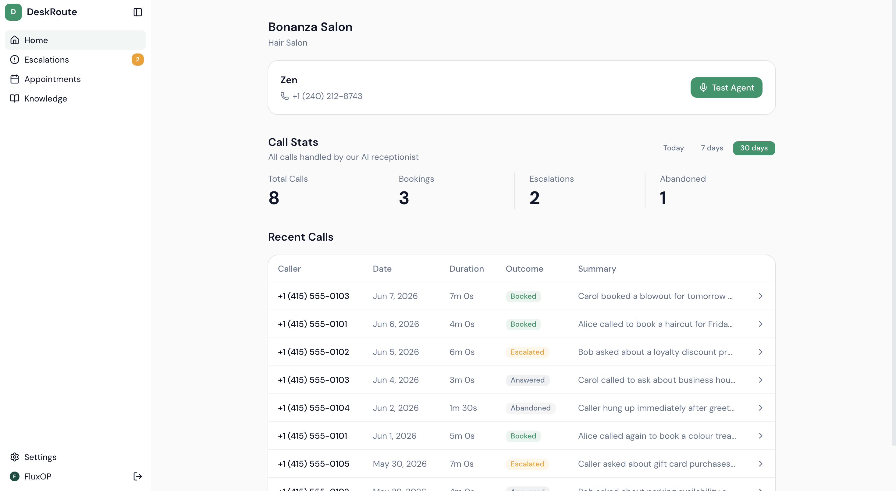
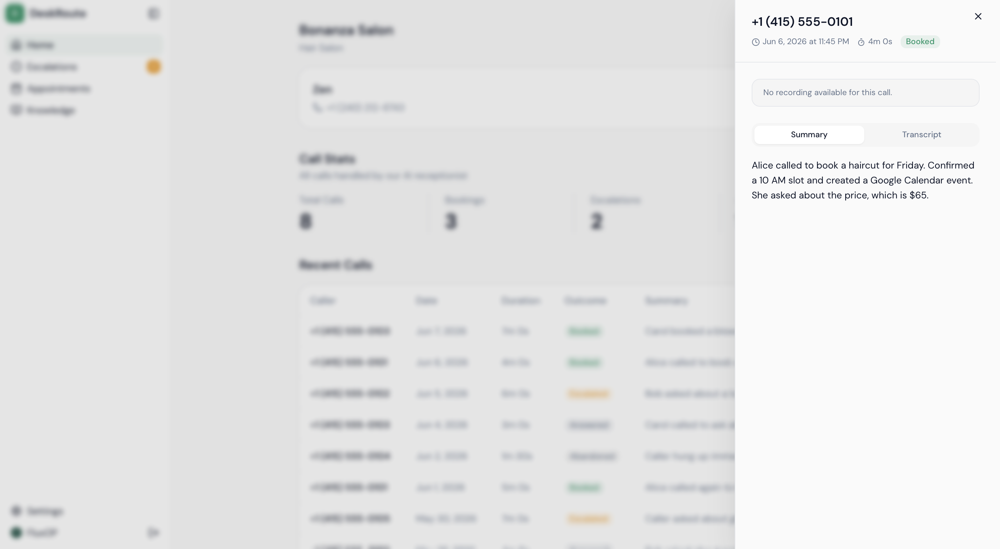
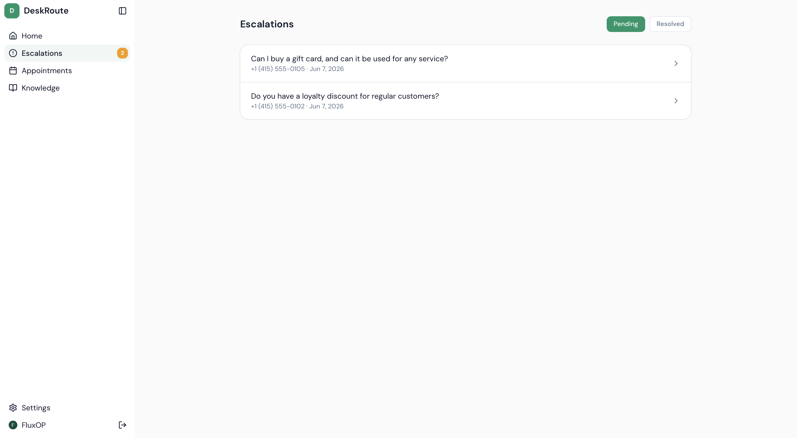
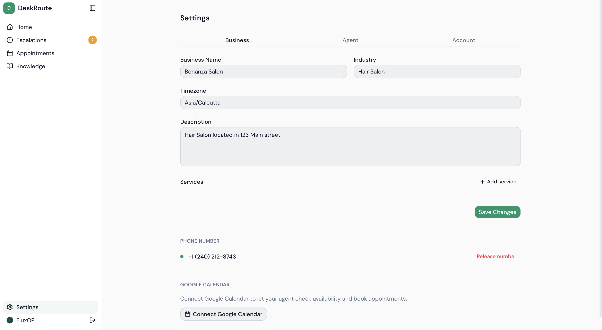
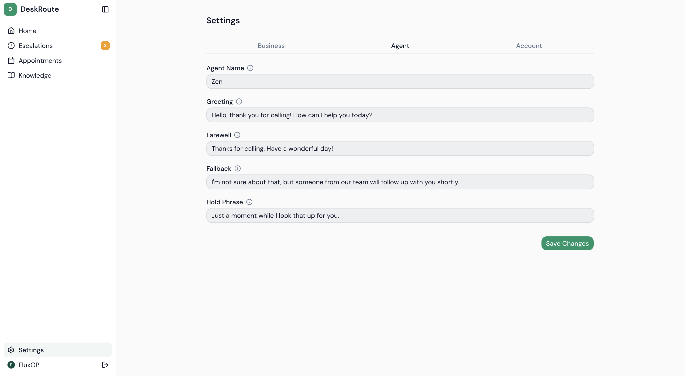

# DeskRoute

An AI receptionist for appointment-based local businesses. Customers call a real US phone number - DeskRoute answers, books appointments via Google Calendar, and escalates anything it can't handle to the business owner through an admin dashboard.

Built as a multi-tenant B2B SaaS.

## Features

- **Real phone calls** - LiveKit Phone Numbers, no SIP trunk setup required
- **Answers from context** - services, pricing, and business details baked into the system prompt at call start; no RAG needed for common questions
- **Knowledge base** - pgvector semantic search for questions beyond the prompt
- **Appointment booking** - checks Google Calendar availability and creates confirmed events by voice
- **Escalation loop** - unanswerable questions flagged for admin review; resolved answers auto-populate the knowledge base
- **Call recordings** - every call recorded with full transcript and AI-generated summary
- **In-browser agent test** - talk to your agent live from the dashboard, no phone call (no recording, no call log)
- **Admin dashboard** - calls, escalations, appointments, knowledge base, and settings
- **Multi-tenant** - every table is tenant-scoped; each business is fully isolated


## How It Works

1. Customer calls the business's US phone number
2. LiveKit routes the call to the AI agent worker via SIP
3. Agent resolves the tenant from the number dialed, builds a system prompt with business context, and greets the caller
4. STT → LLM → TTS pipeline handles the conversation; Silero VAD detects end of turn
5. Pricing and hours answered directly from the system prompt - no tool calls needed
6. Unknown questions: semantic search checks the knowledge base; no match → question flagged for admin
7. Bookings: availability checked against Google Calendar, confirmed event created by voice
8. On hang-up: transcript extracted, summary generated, call record finalized


## Screenshots

**Home - call stats and recent call history**


**Call detail - AI-generated summary and transcript**


**Escalations - unanswered caller questions queued for admin review**


**Settings - business info, phone number, and Google Calendar**


**Settings - agent name, greeting, farewell, and hold phrase**



## Tech Stack

| Layer | Technology |
|---|---|
| API server | Hono (Node.js, ESM) |
| Database | Neon Postgres + Drizzle ORM + pgvector |
| Auth | Clerk |
| Voice pipeline | LiveKit Agents SDK |
| STT | AssemblyAI universal-streaming |
| LLM | OpenRouter - `openai/gpt-4o-mini` recommended |
| TTS | Cartesia Sonic 3 |
| Embeddings | OpenAI text-embedding-3-small (via OpenRouter) |
| VAD | Silero |
| Telephony | LiveKit Phone Numbers |
| Calendar | Google Calendar API |
| Recordings | Cloudflare R2 |
| Frontend | React 19 + Vite + TypeScript |
| UI | Tailwind v4 + shadcn/ui |
| Data fetching | TanStack Query v5 |


## Getting Started

### Prerequisites

- Node.js 22+
- [LiveKit Cloud](https://cloud.livekit.io) project with a US phone number purchased and a SIP dispatch rule configured
- [Clerk](https://clerk.com) application with Google OAuth enabled
- [Neon](https://neon.tech) Postgres database (pgvector extension enabled)
- [Cloudflare R2](https://developers.cloudflare.com/r2/) bucket for call recordings
- [OpenRouter](https://openrouter.ai) API key

### Install

```bash
git clone https://github.com/Flux690/desktroute
cd desktroute
pnpm install
```

### Environment

**`backend/.env`**
```env
PORT=8080
DATABASE_URL=

LIVEKIT_URL=                   # wss://your-project.livekit.cloud
LIVEKIT_API_KEY=
LIVEKIT_API_SECRET=

CLERK_SECRET_KEY=

OPENROUTER_API_KEY=
OPENROUTER_BASE_URL=           # https://openrouter.ai/api/v1
LLM_MODEL=
SUMMARY_LLM_MODEL=             # model used for post-call summaries (can match LLM_MODEL)

EMBEDDING_MODEL=openai/text-embedding-3-small
EMBEDDING_DIMENSIONS=1536      # text-embedding-3-small outputs 1536 dimensions

R2_ACCOUNT_ID=
R2_ACCESS_KEY_ID=
R2_SECRET_ACCESS_KEY=
R2_BUCKET_NAME=
```

**`frontend/.env`**
```env
VITE_CLERK_PUBLISHABLE_KEY=
VITE_API_URL=http://localhost:8080/api
```

### Database

```bash
pnpm -F backend db:generate
pnpm -F backend db:migrate
```

### Run

```bash
pnpm dev            # runs all three below at once via concurrently

# …or run them in separate terminals:
pnpm dev:backend    # API server → http://localhost:8080
pnpm dev:agent      # LiveKit agent worker - keep running alongside the API
pnpm dev:frontend   # Admin dashboard → http://localhost:5173
```


## API Reference

Public:

| Method | Path | Description |
|---|---|---|
| GET | `/api/health` | Liveness check |
| POST | `/api/onboarding` | Create tenant + purchase phone number |
| GET | `/api/onboarding/phone/search?areaCode=415` | Search available numbers (`areaCode` optional) |

Admin - `Authorization: Bearer <clerk_jwt>` required:

| Method | Path | Description |
|---|---|---|
| GET | `/api/admin/metrics?period=30d` | KPI counts |
| GET | `/api/admin/calls` | Paginated call history |
| GET | `/api/admin/calls/:id` | Call detail with transcript |
| GET | `/api/admin/calls/:id/recording` | Presigned recording URL |
| GET | `/api/admin/escalations?status=pending` | Escalation list |
| POST | `/api/admin/escalations/:id/resolve` | Resolve + add to knowledge base |
| GET | `/api/admin/knowledge` | Knowledge base items |
| DELETE | `/api/admin/knowledge/:id` | Delete knowledge item |
| GET | `/api/admin/appointments` | Appointment list |
| GET | `/api/admin/settings` | Tenant settings |
| PATCH | `/api/admin/settings` | Update settings |
| GET | `/api/admin/phone/search?areaCode=415` | Search available numbers (`areaCode` optional) |
| POST | `/api/admin/phone/provision` | Purchase phone number |
| DELETE | `/api/admin/phone` | Release phone number |
| POST | `/api/admin/agent/test` | Create a browser test session (room + join token) |
| DELETE | `/api/admin/account` | Delete tenant and all data |


## License

[ISC](LICENSE) © 2026 Prabhat Mattoo
